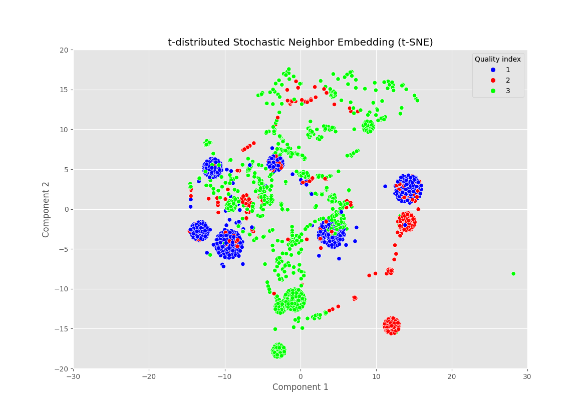
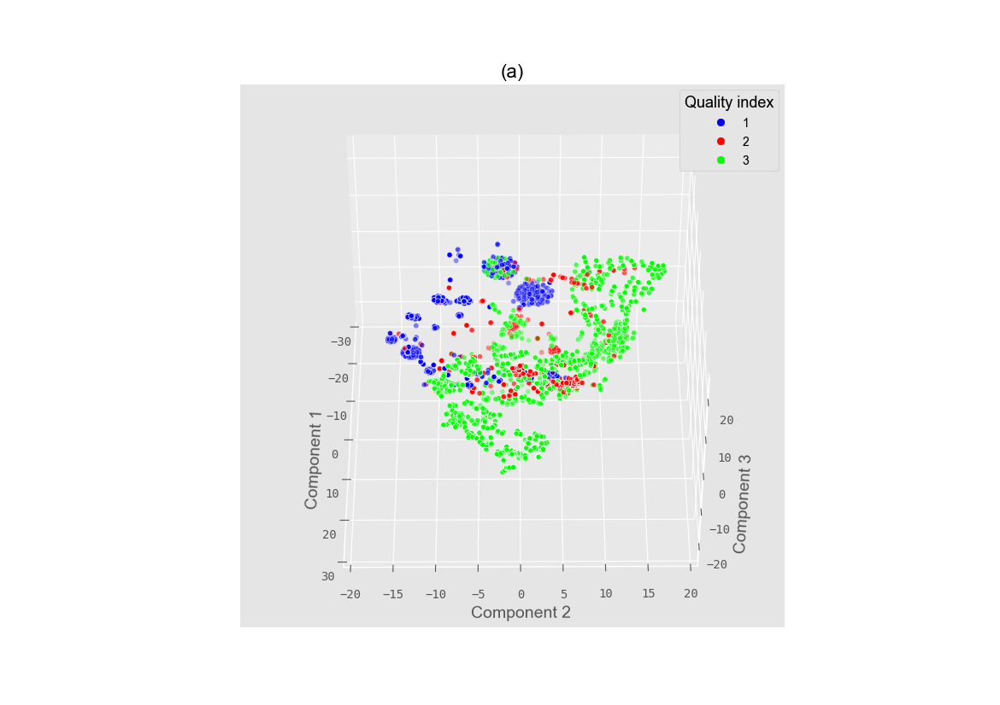

# tSNE-SlateQ

t-distributed Stochastic Neighbour Embedding is a nonlinear statistical method for visualizing high-dimensional data in 2 or 3 dimensions. In other words, it is a manifold dimensional reduction method that allows the representation of data with an important number of features through data points in a low-dimensional space while preserving maximum information. It is based on Stochastic Neighbour Embedding originally developed by Hinton and Roweis [1], while the t-SNE introduces a t-distributed variant as proposed by van der Maaten [2]. One of the key features of t-SNE is that it is able to handle nonlinear relationships between the data points, which makes it well-suited for visualizing complex data structures. It is also relatively robust to noise and can handle missing data.

The algorithm starts by transforming the high-dimensional Euclidean distances between data points into joint probabilities, which contain information on similarities. In the case of data point $x_j$, for example, and data point $x_i$, the joint probability $p_{ij}$ defines the chances that $x_i$ would select $x_j$ as its neighbour if neighbours were chosen in relation to their probability density under a Gaussian distribution centered at $x_i$. This joint probability assumes elevated values for points that are located nearby, while it tends to zero in the opposite case. $p_{ij}$ is defined mathematically in Equation 1:

$$p_{ij}=(p_{j|i}+p_{i|j})/2n$$

where

$$p_{j|i}=(exp(-(||x_i-x_j||^2)/(2\sigma^2_1)))/(\sum_{k \neq i}((-||x_i-x_k||^2)/(2\sigma^2_i)))$$

For the low-dimensional counterparts of the points presented above, t-SNE employs a Student's t-distribution with one degree of freedom. Based on this condition, the joint probability for this case is defined as: 

$$q_{ij}=(1+||y_i-y_j||^2)^{-1}/(\sum_{k \neq l}(1+||y_k-y_l||^2)^{-1})$$

Finally, the algorithm aims to find a low-dimensional data representation that minimizes the discrepancy between both joint probabilities. This is achieved through minimization by gradient descent of the Kullback-Liebler divergence between $p_{ij}$ and $q_{ij}$, as defined in Equation 3.

$$(\delta C)/(\delta y_i)=4\sum_j(p_{ij}-q_{ij})(y_i-y_j)(1+||y_i-y_j||^2)^{-1}$$

## Results

The results of the t-SNE analysis are presented graphically in Figure 1. The blue dots, which represent those slate sections with the lowest quality index (1) are easily clustered by the t-SNE. This implies that those data points with high quality are correlated. Continuing with the data points of medium quality (2), these are more scattered but still present two important clusters. On the other hand, the green dots, which correspond to the lowest slate quality (3), are far more spread out than the other two categories. This is mainly due to the high number of variables that affect the quality index with different degrees of importance.

**Figure 1**. Results of the t-SNE. Each point in the plot represents a slate section. The data points of the highest quality (3) are coloured in green. The two other quality classifications, medium (2) and low (1), are represented in red and blue, respectively.

Given this representation, it can be observed that there are several clusters that contain data points of more than one quality index. It is most noticeable the predominantly-blue clump located between 0 and 10 on the horizontal axis and -5 and 0 on the vertical axis. This cluster contains data points of all three quality levels, which could indicate that there are certain cases in which the t-SNE is not able to classify correctly.

However, the three-dimensional graph contains more information and offers a better representation of the results of the t-SNE. In Figure 2, it can be seen how the addition of a third axis removes the overlap between clusters, while the lowest quality (3) remains the most scattered.

**Figure 2**. Three-dimensional results of the t-SNE. Each point in the plot represents a slate section. The colours used to plot each value of the quality index are conserved. The data points of the highest quality (3) are coloured in green. The two other quality classifications, medium (2) and low (1), are represented in red and blue, respectively.

Lastly, the t-SNE is able to find some correlations between the data and the target variable, quality in this case, but does not provide any information regarding those variables that hold a higher weight in the prediction of the quality index. With this goal in mind, a Bayesian analysis is proposed.

## Bibliography

[1] L. Van Der Maaten and G. Hinton, “Visualizing data using t-SNE,” J. Mach. Learn. Res., vol. 9, pp. 2579–2625, 2008.
[2] G. E. Hinton and S. Roweis, “Stochastic Neighbor Embedding,” in Advances in Neural Information Processing Systems, 2002, vol. 15. [Available here](https://proceedings.neurips.cc/paper/2002/file/6150ccc6069bea6b5716254057a194ef-Paper.pdf.)